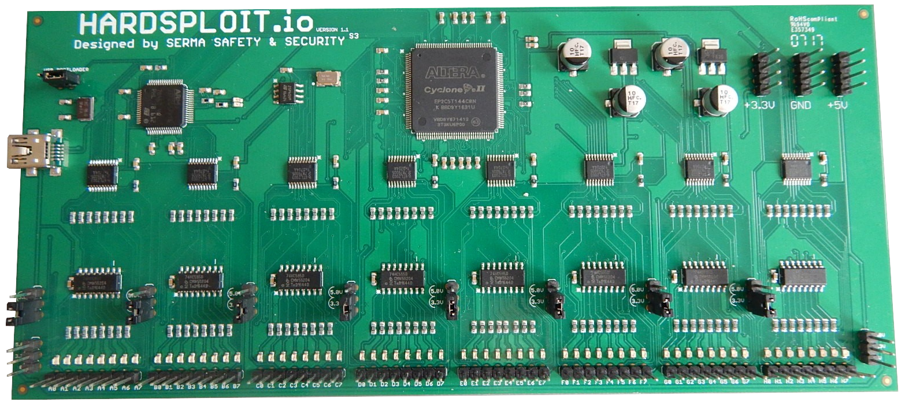

<!-- HEADER -->
 
 
 

  

  <h3 align="center">
    The essential security auditing tool for Internet of Things devices you'll need in your toolbox </h3>
     
     
    

  

   
  

    
  

   

<!-- TABLE OF CONTENTS -->

  <h2>Table of contents</h2>
    <ol>
      <li>
        <a href="#about">About the project</a>
      </li>
      <li>
        <a href="#getting-started">Getting Started</a>
        <ul>
          <li><a href="#prerequisites">Prerequisites</a></li>
          <li><a href="#installation">Installation</a></li>
          <li><a href="#add-perm">Add permission for non root user to use USB</a></li>
        </ul>
      </li>
      <li><a href="#tech-used">Technologies used</a></li>
      <li><a href="#license">License</a></li>
    </ol>

  

<!-- ABOUT THE PROJECT -->

  <table>
    <tr>
      <td>
        <h2>About the project</h2>
        
Hardsploit is an innovative hardware security testing platform designed to aid security researchers, engineers, and auditors in analyzing and evaluating the security of hardware devices.

        
Featuring a modular design, Hardsploit supports various interfaces like JTAG, SPI, I2C, and UART, allowing for extensive hardware testing and reverse engineering.

        

          

            <h4>Main security audit functions:</h4>
            <ul>
              <li><Strong>Sniffer</Strong> (Real-time communication monitoring)</li>
              <li><Strong>Scanner</Strong> (Automatic detection of JTAG, SPI, I2C, and UART interfaces on target devices.)</li>
              <li><Strong>Injection</Strong> (Data injection to test device responses.)</li>
              <li><Strong>Memory dumping</Strong> (Extracting the contents of a chip memory)</li>
              <li><Strong>...</Strong></li>
            </ul>
            <h4>Features:</h4>
            <ul>
              <li><Strong>Advanced Firmware Analysis:</Strong> Detects and analyzes vulnerabilities in firmware.</li>
              <li><Strong>Hardware Exploit Tools:</Strong> Tools to exploit detected vulnerabilities.</li>
              <li><Strong>Secure Firmware Update:</Strong> Updates firmware while ensuring security and integrity.</li>
              <li><Strong>Enhanced User Interface:</Strong> More intuitive and interactive interface.</li>
              <li><Strong>...</Strong></li>
            </ul>
            <h4>Supported communication protocols:</h4>
            <ul>
              <li><Strong>UART</Strong> (Universal Asynchronous Receiver-Transmitter)</li>
              <li><Strong>SPI</Strong> (Serial Peripheral Interface)</li>
              <li><Strong>I2C</Strong> (Inter-Integrated Circuit)</li>
              <li><Strong>JTAG</Strong> (Joint Test Action Group)</li>
              <li><Strong>SWD</Strong> (Serial Wire Debug)</li>
              <li><Strong>NRF24L01 (Work in progress)</Strong></li>
              <li><Strong>...</Strong></li>
            </ul>
          

        

      </td>
    </tr>
  </table>

  

<!-- GETTING STARTED -->

  <h2>Getting Started</h2>
  
This guide will help you quickly get started with Hardsploit, covering the necessary prerequisites and installation steps.

  
  <h3>Pre-requisites</h3>
  
 To be able to start using Hardsploit, make sure that you have the following prerequisites installed:

  <ul>
    <li>Python v3.9 or later</li>
    <li>A Linux machine (tested on Ubuntu, Kali and Raspberry Pi OS)</li>
  </ul>
  
  <h3>Installation</h3>
  <ol>
    <li>
      
Install the hardsploit API.

      <code>pip install hardsploit</code>
    </li>
     
    <li>
    
To learn more about how to use the API, check our <a href="https://gitlabs3.serma.com/serma_s3_iec/produits-s3/hardsploitv1-python/hardsploit/-/wikis/home">Wiki</a>

    </li>
  </ol>
  
  <h3>Add permission for non root user to use USB</h3>
  <ol>
    <li>
      
Copy file in data folder to udevadm system folder /lib/udev/rules.d/.

      <code>sudo cp data/50-Hardsploit.rules /lib/udev/rules.d/.</code>
    </li>
     
    <li>
      
Verify that user is in plugdev group

      <code>groups "user"</code>
    </li>
     
    <li>
      
Else add user to plugdev groupe

      <code>adduser "user" plugdev</code>
    </li>
     
    <li>
      
Force system context reload

      <code> sudo udevadm control --reload </code>   
      <code> sudo udevadm trigger </code> 
       
    </li>
  </ol>
    
If this does not work then reboot.

 

<!-- TECHNOLOGIES USED-->

  <h2>Technologies used</h2>
  
This project has been developed using the following technologies:

  <ul>
    <li><Strong>Python</Strong> (Programming language used for project development.)</li>
    <li><Strong>Poetry</Strong> (Dependency management tool for Python projects.)</li>
    <li><Strong>pyusb</Strong> (Library for USB access on Python, allowing easy communication with USB devices.)</li>
    <li><Strong>colorama</Strong> (Library for colored terminal text in Python, enhancing readability of console output.)</li>
  </ul>

  

<!-- LICENSE -->

  <h2>License</h2>
  
Hardsploit is licensed under *LGPLv3*. See the <a href="http://test.fr">LICENSE</a> file for more information.

